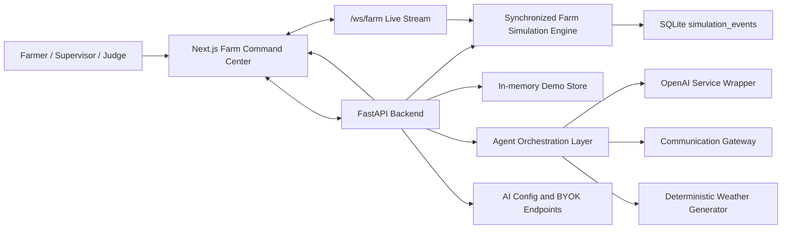
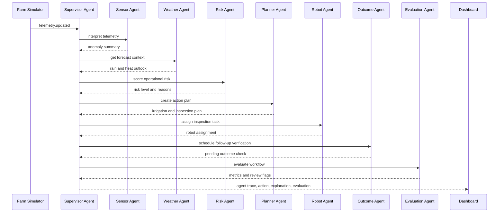
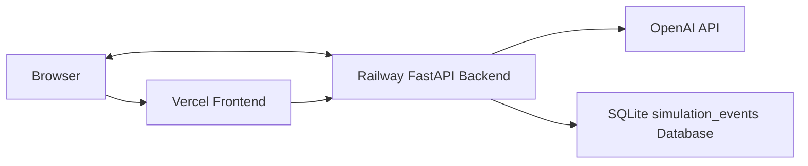

# AgriOS Architecture

## 1. Purpose

This document describes the hackathon architecture for AgriOS, an autonomous farm operating system built around real-time telemetry, multimodal AI, agent orchestration, and observable evaluation.

The architecture favors demo reliability and clean separation of concerns. Synthetic data and deterministic fallbacks are first-class because the project must work in a live judging environment.

## 2. System Context



## 3. Technology Stack

Frontend:

- Next.js 15
- React 19
- TypeScript
- Tailwind CSS
- Custom farm digital twin
- WebSocket client

Backend:

- FastAPI
- Python
- Pydantic models
- WebSocket server
- SQLite for persisted simulation tick history
- In-memory demo store for latest agent trace, scorecards, actions, communications, outcomes, and journal entries
- Mock weather provider for deterministic demo forecasts
- Deterministic autonomy and review gates in the planner/risk agents
- Communication gateway with provider adapters
- AI configuration service for backend-only OpenAI key storage and validation
- Admin alert feed generator for rolling one-hour notification, approval, action, and outcome events

AI services:

- OpenAI text model for farmer-facing copy when configured
- Deterministic fallback copy when OpenAI is disabled or unavailable
- Deterministic demo-image fallback for leaf analysis
- OpenAI speech-to-text for optional voice input
- OpenAI text-to-speech for optional voice output

Deployment:

- Vercel for frontend
- Railway or similar service for backend
- Environment variables for API keys and backend URLs

## 4. Component Architecture

```mermaid
flowchart TB
  subgraph Frontend["Frontend"]
    Command["Farm Command Center"]
    Timeline["Agent Timeline"]
    VisionUI["Vision Center"]
    VoiceUI["Call My Farm"]
    EvalUI["Evaluation Dashboard"]
    ActionsUI["Actions Feed"]
    ExplainUI["Why This Action Panel"]
    JournalUI["Farm Journal"]
    AutonomyUI["Autonomy Controls"]
    CommsUI["Communication Center"]
    AdminUI["Farm Admin Alert Drawer"]
    AIKeyUI["OpenAI Configuration Panel"]
  end

  subgraph Backend["Backend"]
    REST["REST API"]
    WS["WebSocket Hub"]
    Sim["Simulation Engine"]
    SimStorage["SQLite Simulation Storage"]
    DemoStore["Demo Store"]
    Orchestrator["Supervisor Agent"]
    Services["AI Service Wrappers"]
    Config["AI Config Service"]
    AdminFeed["Admin Alert Service"]
    Policy["Autonomy and Review Rules"]
    Gateway["Communication Gateway"]
  end

  subgraph Agents["Domain Agents"]
    Sensor["Sensor Agent"]
    Weather["Weather Agent"]
    Vision["Vision Agent"]
    Risk["Risk Agent"]
    Planner["Planner Agent"]
    Robot["Robot Agent"]
    CommsAgent["Communication Agent"]
    Outcome["Outcome Agent"]
    Voice["Voice Agent"]
    Memory["Memory Agent"]
    Eval["Evaluation Agent"]
  end

  Command <--> WS
  Timeline <--> WS
  ActionsUI <--> WS
  ExplainUI <--> WS
  JournalUI <--> WS
  AutonomyUI --> REST
  CommsUI <--> WS
  AdminUI <--> WS
  AIKeyUI --> REST
  VisionUI --> REST
  VoiceUI --> REST
  REST --> Orchestrator
  REST --> Config
  REST --> Policy
  REST --> Gateway
  WS --> Command
  WS --> Sim
  Sim --> Orchestrator
  Sim --> SimStorage
  Sim --> AdminFeed
  Orchestrator --> Sensor
  Orchestrator --> Weather
  Orchestrator --> Vision
  Orchestrator --> Risk
  Orchestrator --> Planner
  Orchestrator --> Robot
  Orchestrator --> CommsAgent
  Orchestrator --> Outcome
  Orchestrator --> Voice
  Orchestrator --> Memory
  Orchestrator --> Eval
  Orchestrator --> DemoStore
  Policy --> Orchestrator
  Orchestrator --> Services
  CommsAgent --> Gateway
```



## 5. Runtime Workflows

### 5.1 Sensor Anomaly Workflow



### 5.2 Vision Workflow

1. Frontend uploads a leaf image to the backend.
2. Backend stores the request metadata.
3. Supervisor starts a `vision_analysis` agent run.
4. Vision Agent calls the AI vision service or deterministic fallback.
5. Risk Agent combines image result with latest farm telemetry.
6. Planner Agent recommends inspection or treatment review.
7. Evaluation Agent scores the workflow.
8. Backend broadcasts updates to the timeline, action feed, and evaluation dashboard.

### 5.3 Voice Workflow

1. User starts "Call My Farm".
2. Frontend captures microphone audio or accepts text fallback.
3. Backend transcribes audio if needed.
4. Voice Agent retrieves latest farm state, actions, and agent findings.
5. Voice Agent generates a concise farm-manager response.
6. Backend returns text and optional audio.
7. Frontend displays and plays the response.

### 5.4 Weather-Aware Planning Workflow

1. Weather Agent reads deterministic demo forecast data.
2. Risk Agent combines weather with moisture, temperature, image findings, and memory.
3. Planner Agent decides whether to irrigate now, delay, or request approval.
4. Policy engine checks autonomy mode and action risk.
5. Dashboard shows the recommendation and "Why this action?" explanation.

### 5.5 Communication Workflow

1. Planner Agent, Risk Agent, Voice Agent, or Policy Engine requests farmer communication.
2. Communication Agent determines message urgency and channel preference.
3. Communication Gateway dispatches through the configured adapter.
4. Backend stores delivery state and provider metadata.
5. Dashboard shows the communication event in the timeline and audit trail.

Supported channel adapters:

- In-app notification or call simulation
- Mobile message or SMS adapter
- WhatsApp adapter
- Telegram bot adapter

### 5.6 Outcome Verification Workflow

1. Planner Agent creates an action with an expected outcome.
2. Outcome Agent stores the baseline farm state.
3. Simulator emits follow-up telemetry.
4. Outcome Agent compares baseline and post-action values.
5. Memory Agent writes a farm journal entry.
6. Evaluation Agent updates workflow success metrics.

## 6. Agent Responsibilities

| Agent | Responsibility | Key Output |
| --- | --- | --- |
| Supervisor Agent | Coordinates workflow and routes context | Agent run trace |
| Sensor Agent | Interprets telemetry and anomalies | Sensor summary |
| Weather Agent | Adds forecast context to decisions | Forecast summary and planning impact |
| Vision Agent | Analyzes uploaded leaf images | Disease, severity, confidence |
| Risk Agent | Scores urgency and operational risk | Risk level and reasons |
| Planner Agent | Converts risk into action plan | Recommended actions |
| Robot Agent | Assigns robot inspection tasks | Robot task assignment |
| Communication Agent | Chooses and dispatches farmer notifications | Channel message and delivery status |
| Outcome Agent | Verifies whether actions improved farm state | Outcome status and before/after values |
| Voice Agent | Communicates farm status to user | Spoken or text response |
| Memory Agent | Maintains farm journal and recent history | Relevant prior events |
| Evaluation Agent | Scores agent behavior | Metrics and review flags |

## 7. Data Contracts

### 7.1 Agent Step Output

All agents should return a shared envelope.

```json
{
  "agent": "planner",
  "status": "completed",
  "summary": "Irrigation scheduled for Zone B and Robot R1 assigned for inspection.",
  "confidence": 0.94,
  "latencyMs": 820,
  "estimatedCostUsd": 0.002,
  "requiresHumanReview": false,
  "explanation": [
    "Zone B moisture is below the critical threshold.",
    "No heavy rain is expected in the next 6 hours.",
    "Previous irrigation in Zone B improved moisture by 16 percentage points."
  ],
  "data": {
    "actions": [
      {
        "type": "schedule_irrigation",
        "zone": "Zone B",
        "priority": "high",
        "status": "scheduled"
      }
    ]
  }
}
```

### 7.2 Telemetry Event

```json
{
  "type": "telemetry.updated",
  "timestamp": "2026-06-13T10:00:00Z",
  "zone": "Zone B",
  "metrics": {
    "soilMoisture": 12,
    "temperature": 33,
    "humidity": 48,
    "tankLevel": 64
  },
  "severity": "critical"
}
```

### 7.3 Autonomous Action

```json
{
  "id": "action_001",
  "type": "schedule_irrigation",
  "title": "Irrigation scheduled for Zone B",
  "zone": "Zone B",
  "priority": "high",
  "status": "scheduled",
  "sourceAgentRunId": "run_001",
  "expectedOutcome": {
    "metric": "soilMoisture",
    "targetValue": 25,
    "verificationWindowMinutes": 10
  },
  "createdAt": "2026-06-13T10:00:05Z"
}
```

### 7.4 Weather Snapshot

```json
{
  "type": "weather.updated",
  "timestamp": "2026-06-13T10:00:00Z",
  "summary": "Light rain expected in 6 hours",
  "rainProbability": 0.68,
  "temperatureHigh": 34,
  "planningImpact": "Delay irrigation unless moisture drops below 10%"
}
```

### 7.5 Outcome Check

```json
{
  "id": "outcome_001",
  "actionId": "action_001",
  "status": "successful",
  "metric": "soilMoisture",
  "beforeValue": 12,
  "afterValue": 28,
  "targetValue": 25,
  "summary": "Zone B moisture recovered after irrigation."
}
```

### 7.6 Autonomy Policy

```json
{
  "mode": "auto_schedule_low_risk",
  "requiresApprovalWhen": {
    "riskLevel": "high",
    "confidenceBelow": 0.8,
    "estimatedCostUsdAbove": 0.05
  }
}
```

### 7.7 Communication Request

```json
{
  "id": "comm_001",
  "runId": "run_001",
  "actionId": "action_001",
  "severity": "critical",
  "preferredChannels": ["whatsapp", "telegram", "sms", "phone_call"],
  "selectedChannel": "whatsapp",
  "recipientRole": "farmer",
  "message": "Zone B moisture is critically low. Short irrigation has been scheduled and will be verified in 10 minutes.",
  "status": "simulated",
  "providerMessageId": null
}
```

## 8. Real-Time Events

The implemented live stream is `WS /ws/farm`. It sends recent stored simulation
events on connect, then sends one synchronized `simulation.tick` event per
simulation interval.

Implemented WebSocket event:

- `simulation.tick`

Each tick contains:

- `eventId`, `type`, `sequence`, and `createdAt`.
- `data.farmState` with zones, robot route state, assets, active actions,
  approvals, communication events, outcomes, journal entries, latest telemetry,
  and simulation metadata.
- `data.telemetry` with the current inspection context.
- `data.sensorEnvelope` and `data.robotEnvelope` using the shared agent envelope.
- `data.agentTrace` for the simulation tick.

Workflow events such as `agent.trace.updated`, `action.created`,
`communication.simulated`, `outcome.verified`, and `evaluation.updated` are
created in the demo store after REST-triggered workflows. They are currently
reflected through `/farm/state`, `/agents/trace`, and `/evaluation/scorecards`.

Future live event names:

- `telemetry.updated`
- `agent.run.started`
- `agent.step.started`
- `agent.step.completed`
- `agent.step.failed`
- `action.created`
- `action.updated`
- `action.approval_requested`
- `communication.queued`
- `communication.sent`
- `communication.failed`
- `communication.simulated`
- `evaluation.updated`
- `weather.updated`
- `outcome.updated`
- `memory.entry.created`
- `voice.session.updated`

Payload rules:

- Include `createdAt` or `timestamp`.
- Include `runId` for workflow-related events.
- Include `actionId` for action, approval, and outcome events.
- Include `communicationId` for communication events.
- Keep event payloads JSON-compatible.
- Avoid sending raw image data over WebSocket.

## 9. Persistence Model

Implemented persistence:

- SQLite table `simulation_events` stores the synchronized simulation tick stream.
- `DATABASE_URL=sqlite:///./agrios.db` configures the default SQLite file.
- `AGRIOS_SIMULATION_DB_PATH` can override the simulation database path.
- `SIMULATION_RETENTION_MINUTES` controls event retention.

Implemented in-memory demo state:

- Latest agent trace.
- Evaluation scorecards.
- Active actions and pending approvals.
- Communication events.
- Outcome checks.
- Farm journal entries.

Planned persistent tables for production or a longer-lived demo:

- `telemetry_events`
- `agent_runs`
- `agent_steps`
- `actions`
- `evaluations`
- `vision_analyses`
- `voice_sessions`
- `weather_snapshots`
- `outcome_checks`
- `farm_journal_entries`
- `approval_decisions`
- `autonomy_settings`
- `communication_events`
- `channel_preferences`

## 10. API Surface

Implemented endpoints:

- `GET /health`
- `GET /farm/state`
- `GET /agents/trace`
- `POST /vision/analyze`
- `POST /voice/ask`
- `GET /evaluation/scorecards`
- `GET /simulation/status`
- `GET /simulation/events`
- `POST /simulation/reset`
- `GET /ai/config/status`
- `POST /ai/config/validate`
- `POST /ai/config/openai-key`
- `WS /ws/farm`

Planned endpoints:

- `GET /actions`
- `POST /actions/{action_id}/approve`
- `POST /actions/{action_id}/reject`
- `GET /weather/current`
- `GET /journal`
- `GET /autonomy`
- `POST /autonomy`
- `GET /communications`
- `POST /communications/test`
- `GET /channel-preferences`
- `POST /channel-preferences`

API implementation rules:

- Validate inputs with typed models.
- Return structured errors.
- Do not expose OpenAI keys to the frontend.
- Include request IDs for debuggability.

## 11. Demo Reliability Strategy

- Keep the simulator deterministic enough to reproduce the main demo.
- Provide fallback vision output for known demo images.
- Provide deterministic weather scenarios.
- Provide deterministic outcome verification after irrigation.
- Use simulated communication delivery by default.
- Allow exactly one real provider channel to be enabled for the demo if credentials are ready.
- Provide text fallback for voice.
- Provide canned Marathi response if speech services fail.
- Default to requiring approval for high-risk actions.
- Keep all critical demo data available without external hardware.
- Make failures visible but non-blocking in the UI.

## 12. Deployment Architecture



## 13. Future Architecture

- Move agent traces, actions, communications, outcomes, approvals, and journal
  entries from the in-memory demo store to durable storage.
- Replace or complement SQLite with Postgres for multi-user production data.
- Add queue workers for long-running agent jobs.
- Add real IoT ingestion through MQTT or HTTP.
- Add role-based access control.
- Add farm-specific memory and historical analytics.
- Add live weather provider integration.
- Add model-driven outcome learning from historical farm results.
- Integrate real robot and irrigation APIs.
