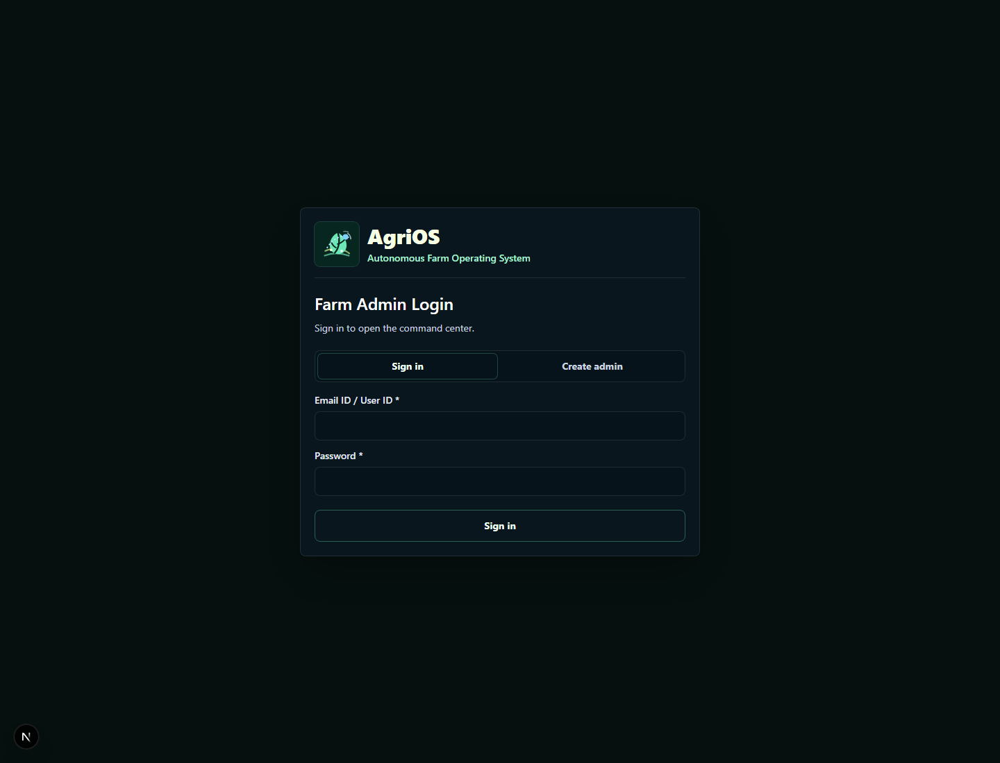
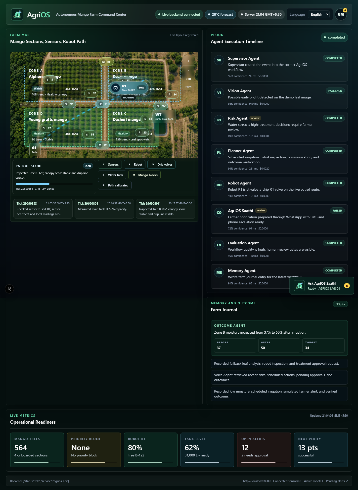
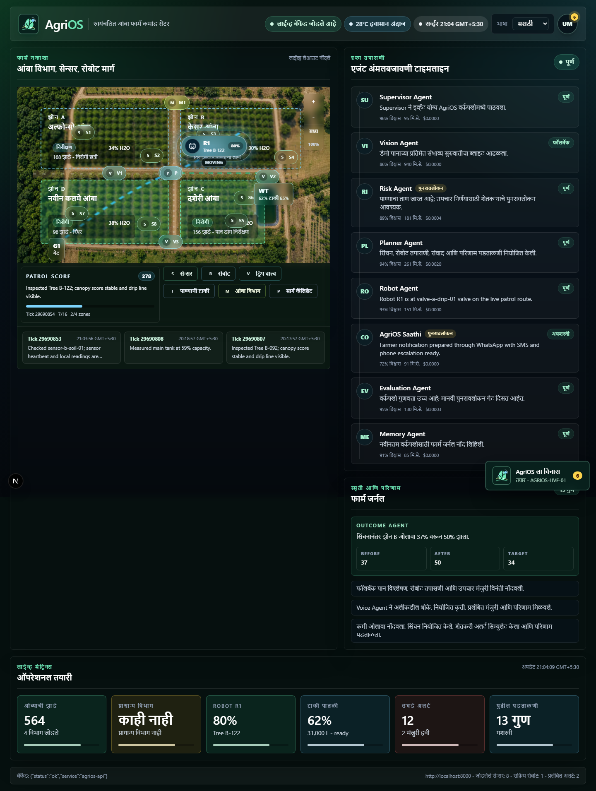
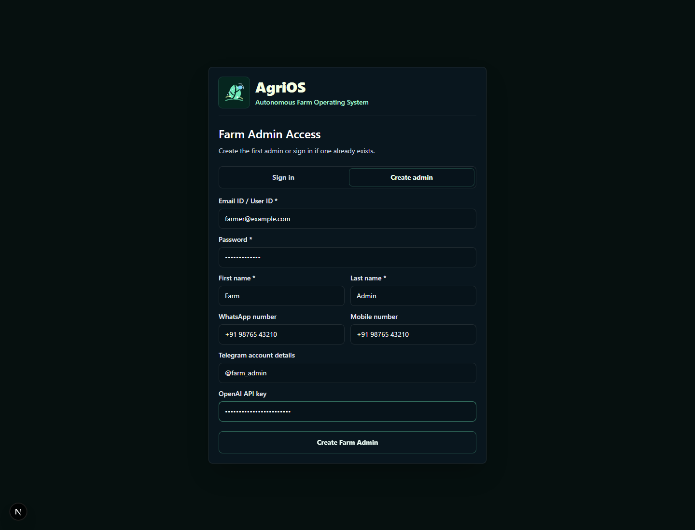
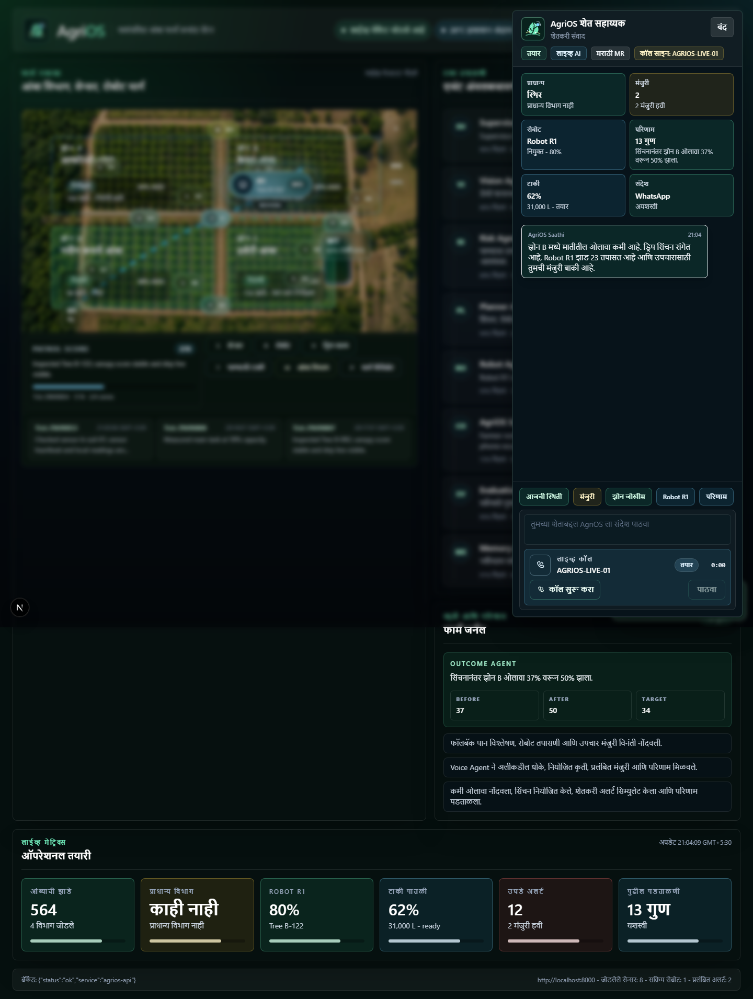
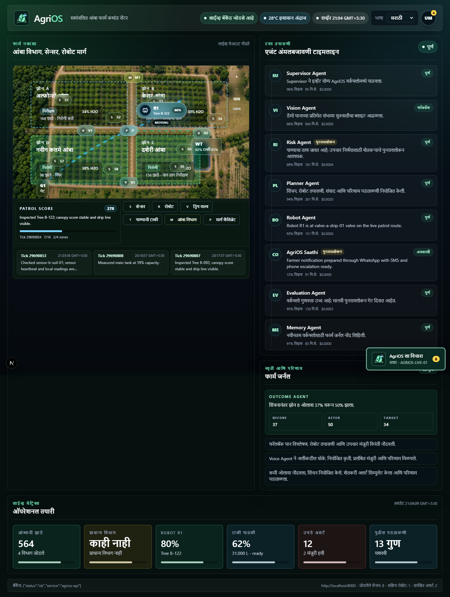
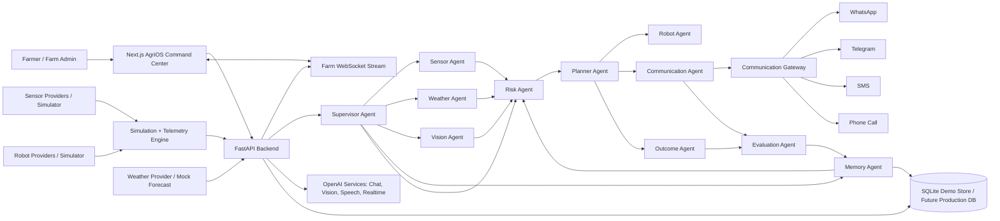

# AgriOS Autonomous Farm

AgriOS is an AI-native farm operating system for orchards and field operations.
It helps a farmer or farm manager see what is happening across the farm, detect
risk early, coordinate robots and sensors, receive emergency communication,
approve high-risk actions, and verify whether the action actually worked.

The current application is a deterministic simulation and gamified mango farm
command center. That keeps the demo reliable for hackathons and reviews. The
same architecture is designed to accept real sensor telemetry, robot provider
events, weather data, communication providers, and OpenAI-backed voice, chat, and
vision services when those production partnerships are enabled.

## Purpose

AgriOS is built for farms where the farmer cannot manually inspect every tree,
sensor, valve, tank, and robot route in real time. With partner integrations, it
can become the coordination layer between the farmer and the physical farm:

- Continuous visibility from soil sensors, weather, robot telemetry, farm zones,
  water tank state, and historical farm memory.
- Early risk detection for moisture stress, crop disease, tank level issues,
  robot status, and urgent operational events.
- Human-review gates for actions that are high-risk, low-confidence, expensive,
  or irreversible.
- Local-language support through the command center, chat, voice, and outbound
  communication channels.
- Outcome verification so AgriOS can say whether irrigation, inspection, or
  treatment improved the farm state instead of only saying an action was planned.

## Current Mode vs Production Mode

| Area | Current simulation and demo mode | Production-capable mode |
| --- | --- | --- |
| Farm data | Deterministic mango farm simulation with mock sensor, robot, weather, and farm state | Live sensor streams, robot provider APIs, weather feeds, farm inventory, and operational history |
| AI workflows | Deterministic multi-agent workflows with safe fallback responses | OpenAI-backed chat, vision, speech, realtime voice, and structured agent reasoning |
| Communication | Simulated delivery events and escalation status | WhatsApp, Telegram, SMS, and phone-call providers behind the Communication Gateway |
| Actions | Simulated irrigation, robot inspection, treatment review, and outcome checks | Partner APIs for irrigation controllers, robots, work orders, and approval-backed execution |
| Memory | Demo store and SQLite-backed simulation event history | Persistent production database for agent runs, farm journal, outcomes, approvals, and audit history |

The important boundary is intentional: frontend components do not call provider
SDKs directly. External providers should be wrapped by backend services,
gateways, and typed API contracts.

## Verification Notes for Judges

If a judging tool reports `No GitHub scrape available`, first confirm the repo is
public and reachable at `https://github.com/umang6287/AgroOS`. The source code
is the evidence for the agentic claims; screenshots alone are not enough.

AgriOS currently uses a custom Python orchestration layer rather than LangChain,
CrewAI, or a Codex-specific agent framework. The implementation is intentionally
small and inspectable:

| Claim to verify | Evidence in this repo |
| --- | --- |
| Modular agents, not one monolithic LLM call | `backend/app/agents/` contains separate Supervisor, Sensor, Weather, Vision, Risk, Planner, Robot, Communication, Outcome, Voice, Memory, and Evaluation agent modules. |
| Stateful workflow trace | `backend/app/agents/supervisor_agent.py` records ordered workflow runs through `record_workflow`, including sensor, vision, and voice workflows. |
| Memory preservation | `backend/app/agents/memory_agent.py`, `backend/app/memory/farm_journal.py`, and the demo store persist journal entries for later planning and voice summaries. |
| Tool or gateway use | `backend/app/agents/communication_agent.py` calls `backend/app/services/communication_gateway.py`, which routes in-app, WhatsApp, Telegram, SMS, and phone-call delivery behind one gateway. |
| Closed-loop verification | `backend/app/agents/outcome_agent.py` stores a baseline moisture value, compares accelerated follow-up telemetry, and records before/after values. |
| Error handling and fallback | `backend/app/services/communication_gateway.py` retries communication through Telegram fallback when Twilio delivery fails and marks failed delivery for human review. |
| OpenAI integration | `backend/app/services/openai_service.py` uses the OpenAI Python SDK, Responses API structured JSON output, speech/text fallback, and Realtime session setup when an API key is configured. |
| Demo contract tests | `backend/tests/test_api_contracts.py` verifies complete agent traces, vision fallback, voice fallback, simulation events, auth gating, and provider callback handling. |
| Communication gateway tests | `backend/tests/test_communication_gateway.py` verifies Twilio success, Telegram direct send, Telegram fallback after Twilio failure, critical SMS plus phone-call routing, and disabled-fallback failure behavior. |

What is real in the current repo:

- FastAPI backend routes, WebSocket-ready state, SQLite/demo-store state, custom
  agent modules, agent traces, memory entries, outcome checks, evaluation
  scorecards, OpenAI service wrappers, Twilio/Telegram gateway logic, and tests.
- Deterministic simulator data for farm telemetry, robot state, weather context,
  demo vision, and accelerated outcome verification.
- OpenAI-backed farmer-facing copy, speech, and realtime voice paths when
  `OPENAI_API_KEY` and live-mode configuration are provided.

What is intentionally simulated or partner-ready:

- Real field sensors, MQTT/IoT ingestion, irrigation controllers, satellite
  verification, production robot APIs, and production weather providers are not
  required for the hackathon demo.
- Leaf disease analysis currently uses a deterministic known-demo-image fallback
  rather than TensorFlow, OpenCV, or a dedicated computer-vision model pipeline.
- The outcome proof in demo mode compares stored baseline telemetry against
  accelerated simulated follow-up telemetry. Production mode should replace that
  with sensor polling or partner APIs before controlling real-world irrigation.

To prove the closed loop during review, run the backend tests or open the app and
show this sequence in the agent timeline: sensor event -> risk score -> plan ->
robot assignment -> farmer communication -> outcome verification -> evaluation
-> memory journal entry.

## Farmer Journey

1. **Create Farm Admin**
   - The first user creates the farm admin account.
   - The setup form captures name, login, WhatsApp number, mobile number,
     Telegram account, and an optional OpenAI API key.

2. **Sign in**
   - Returning users sign in to open the command center.
   - The authenticated view shows the farm map, live metrics, agent timeline,
     autonomous action queue, communication status, outcome checks, and memory.

3. **Bring your own OpenAI key**
   - If an OpenAI key is provided, AgriOS can enable live AI-backed capabilities
     such as richer chat, voice, speech, vision, and realtime call behavior.
   - Without the key, the app still runs the dashboard, simulation, mock farm
     state, deterministic agent workflows, fallback voice/vision, and demo-safe
     responses.
   - Features that may be degraded without a key include live AI chat, live
     voice calls, provider-backed speech, and richer model-generated reasoning.

4. **Work in the farmer's language**
   - The command center supports English, Marathi, Hindi, and Gujarati UI copy.
   - AgriOS Saathi can brief the farmer in local language using the same farm
     state, risk, action, approval, and outcome context.

5. **Monitor the farm**
   - The command center shows mango sections, sensors, drip valves, robot path,
     tank level, open alerts, priority block, and latest backend status.
   - WebSocket updates and backend fallback handling keep the demo resilient.

6. **Handle risk**
   - Sensor and weather context flow into risk scoring.
   - The Planner Agent can queue irrigation, request robot inspection, prepare a
     farmer alert, and schedule outcome verification.
   - High-risk or uncertain treatment decisions are held for farmer approval.

7. **Talk to the farm**
   - The chat panel lets the farmer ask AgriOS Saathi about today's status,
     approvals, risks, robot location, outcomes, and communications.
   - The voice controls support a "Call My Farm" experience with live-call and
     recording fallback behavior.

8. **Communicate during emergencies**
   - The Communication Agent chooses a farmer notification path based on
     preference and severity.
   - Info can stay in-app, warnings can go through WhatsApp or Telegram, and
     critical alerts can escalate to SMS plus phone call.

9. **Verify and remember**
   - The Outcome Agent compares baseline telemetry against follow-up telemetry.
   - The Memory Agent writes farm journal entries so future planning can use
     what worked before.

## Screenshots

| View | Screenshot |
| --- | --- |
| Farm Admin login |  |
| First admin setup |  |
| Command center in English |  |
| Local-language command center |  |
| Bring your own OpenAI key / admin settings |  |
| AgriOS Saathi chat agent |  |
| Live call and voice agent controls |  |
| Emergency communication gateway |  |
| Agent performance and evaluation |  |

## Agents Available

| Agent | Role in AgriOS |
| --- | --- |
| Supervisor Agent | Routes events into the correct workflow and coordinates agent execution. |
| Sensor Agent | Interprets telemetry and detects anomalies such as low moisture or tank risk. |
| Weather Agent | Adds forecast context so plans account for rain, heat, and near-term conditions. |
| Vision Agent | Analyzes uploaded or robot-captured leaf images for disease and severity. |
| Risk Agent | Scores urgency, confidence, and reasons across sensor, weather, vision, and memory context. |
| Planner Agent | Converts risk into recommended or scheduled actions based on autonomy rules. |
| Robot Agent | Assigns inspection tasks and routes to available robot partners or simulated robots. |
| Communication Agent / AgriOS Saathi | Chooses the farmer notification channel, message, severity, and delivery path. |
| Outcome Agent | Compares before/after telemetry to verify whether an action worked. |
| Voice Agent | Answers farm-status questions through text, recorded audio, or live-call workflows. |
| Memory Agent | Maintains the farm journal and retrieves relevant historical context. |
| Evaluation Agent | Scores workflow quality, safety, latency, cost, fallback behavior, and review flags. |

## How Agents Are Evaluated

AgriOS exposes agent evaluation in the UI so an operator can see whether a
decision was fast, low-cost, high-confidence, and safely gated for review. The
scorecard can include:

- **Confidence:** how certain the agent is about its output.
- **Quality score:** evaluator judgment of output usefulness and correctness.
- **Latency:** time spent by the agent or workflow step.
- **Estimated cost:** estimated model or provider cost.
- **Human review requirement:** whether the decision should be approved before
  execution.
- **Routing accuracy:** whether the Supervisor Agent selected the right workflow.
- **Delivery success:** whether communication reached the intended path.
- **Fallback success:** whether demo-safe or provider fallback behavior worked.
- **Language match:** whether the response matched the selected farmer language.
- **Grounding:** whether the answer stayed tied to farm state and agent context.
- **Conversation answer score:** whether the chat or voice response answered the
  farmer's question.


## Architecture



Provider SDKs and credentials should stay behind backend service wrappers and
communication gateways. The frontend should use the AgriOS API and WebSocket
contracts only.

## Communication Provider Setup

AgriOS can simulate farmer notifications without provider credentials. To try
real WhatsApp, Telegram, SMS, or SOS phone-call delivery after cloning the repo,
configure the backend communication gateway and keep all secrets in local
`.env` files.

### Twilio for WhatsApp, SMS, and SOS calls

Twilio is used for three channels in this repo: WhatsApp messages, SMS alerts,
and phone calls for critical SOS-style escalation.

1. Create a Twilio account at [twilio.com/try-twilio](https://www.twilio.com/try-twilio).
2. Verify your email address and mobile number.
3. Open the [Twilio Console](https://console.twilio.com/) and copy your
   `Account SID` and `Auth Token`.
4. Buy or select a Twilio phone number that supports SMS and Voice.
5. For trial accounts, add your personal phone number as a verified recipient.
6. For WhatsApp development, open the Twilio WhatsApp Sandbox, follow the join
   instructions from your phone, and note the sandbox sender number. The common
   sandbox number is `+14155238886`, but use the value shown in your console.
7. Add these values to `backend/.env`:

```env
TWILIO_ACCOUNT_SID=ACxxxxxxxxxxxxxxxxxxxxxxxxxxxxxxxx
TWILIO_AUTH_TOKEN=your_twilio_auth_token
TWILIO_TRIAL_NUMBER=+15551234567
TWILIO_WHATSAPP_NUMBER=+14155238886
VERIFIED_MOBILE_NUMBER=+919876543210
```

Use E.164 phone format: country code plus number, with no spaces, for example
`+919876543210`.

For local experiments, the `Communication/Twilio/` folder also contains small
standalone scripts:

```powershell
cd Communication\Twilio
python -m venv .venv
.\.venv\Scripts\Activate.ps1
python -m pip install twilio python-dotenv flask
python send_sms.py
python whatsapp_msg.py
python make_call.py
```

For inbound WhatsApp webhook testing, install ngrok and expose the local Flask
script:

```powershell
python whatsappMe.py
ngrok http 5000
```

Then set the Twilio WhatsApp Sandbox **When a message comes in** webhook to:

```text
https://<your-ngrok-domain>/whatsapp
```

The backend gateway can also use a public backend URL for Twilio delivery status
and voice-answer callbacks:

```env
AGRIOS_PUBLIC_BACKEND_URL=https://your-public-backend.example.com
```

If `AGRIOS_PUBLIC_BACKEND_URL` is not set, SOS phone calls still use inline
TwiML so the farmer hears the alert message when they answer.

### Telegram alerts

Telegram is useful as a backup alert path when WhatsApp/SMS/phone delivery is
not available.

1. Open Telegram and message `@BotFather`.
2. Run `/newbot`, choose a bot name and username, and copy the bot token.
3. Start a chat with your new bot and send any message to it.
4. Get your chat ID. A quick way is to open:

```text
https://api.telegram.org/bot<YOUR_BOT_TOKEN>/getUpdates
```

5. Put the token and chat ID in `backend/.env`:

```env
TELEGRAM_BOT_TOKEN=123456789:your_bot_token
TELEGRAM_CHAT_ID=123456789
```

The backend also accepts the older script variable names `BOT_TOKEN` and
`CHAT_ID`. The standalone test script is:

```powershell
cd Communication\Telegram
python -m pip install requests
python TheSender.py
```

### Farm Admin contact details

During first admin setup, enter the farmer's WhatsApp number, mobile number, and
Telegram account/chat ID. The backend gateway resolves recipients in this order:

- request-specific recipient fields, when an API call provides them;
- Farm Admin profile contact fields;
- environment fallback values such as `VERIFIED_MOBILE_NUMBER` or
  `TELEGRAM_CHAT_ID`.

This means a local tester can either fill contact details in the Farm Admin UI or
use environment variables while trying the provider scripts.

### Escalation behavior

AgriOS routes communication by severity:

- Info: in-app notification.
- Warning or high risk: WhatsApp by default.
- Approval needed: WhatsApp approval path.
- Critical/SOS: SMS plus phone call.
- Twilio failure: Telegram fallback when configured.

The UI will still show simulated delivery status when providers are not
configured, so the demo remains usable without external accounts.

### Safety and compliance

- Never commit real `.env` files, Twilio tokens, Telegram bot tokens, or phone
  numbers.
- Get the farmer's consent before sending WhatsApp, SMS, Telegram, or phone-call
  alerts.
- Respect opt-out requests such as `STOP`.
- Production WhatsApp usually requires a verified WhatsApp Business sender and
  approved templates for business-initiated messages.
- Validate provider webhooks before trusting inbound commands in production.
- Keep command execution disabled or strictly allowlisted for inbound WhatsApp or
  Telegram messages.

## Repository Layout

- `frontend/`: Next.js command center, Tailwind UI, live farm state, admin alert drawer, voice, vision, and demo panels.
- `backend/`: FastAPI API, simulation engine, SQLite event storage, agents, services, and route modules.
- `docs/`: API contracts, workflows, demo fallbacks, sample data, screenshots, and deployment guide.
- `deployments/`: Provider-specific deployment notes.
- `scripts/`: Local setup and helper scripts.
- `Prompts/`: Agent prompts and implementation prompts.
- `Communication/`: Provider experiments and wrappers for messaging integrations.

## Local Development

Backend:

```bash
cd backend
pip install -r requirements.txt
uvicorn main:app --reload
```

Useful backend environment variables:

```text
DATABASE_URL=sqlite:///./agrios.db
AGRIOS_SIMULATION_DB_PATH=./agrios.db
SIMULATION_TICK_SECONDS=60
SIMULATION_RETENTION_MINUTES=60
OPENAI_API_KEY=
OPENAI_LIVE_ENABLED=true
```

Frontend:

```bash
cd frontend
npm install
npm run dev
```

Create `frontend/.env.local` for local frontend-to-backend calls:

```text
NEXT_PUBLIC_API_BASE_URL=http://localhost:8000
NEXT_PUBLIC_WS_URL=ws://localhost:8000/ws/farm
```

## Verification

Frontend:

```bash
cd frontend
npm run build
```

Backend import smoke check:

```bash
python -c "import sys; sys.path.insert(0, 'backend'); import main; print('backend import ok')"
```

Backend tests exist under `backend/tests`, but `pytest` is not currently included
in runtime requirements. Install dev dependencies before running tests:

```bash
python -m pip install -r backend/requirements-dev.txt
python -m pytest
```

## Deployment

- Deploy `frontend/` to Vercel.
- Deploy `backend/` to Railway.
- Set `NEXT_PUBLIC_API_BASE_URL` and `NEXT_PUBLIC_WS_URL` in Vercel.
- Set `FRONTEND_URL`, `CORS_ORIGINS`, and `DEMO_MODE` in Railway.

See `docs/deployment-guide.md` for full steps.

## Current Status

The frontend command center is demo-safe and renders backend farm state with
mock-data fallback. The backend has working health, farm state, agent trace,
vision, voice, evaluation, AI configuration, simulation control, and `/ws/farm`
contracts. The simulation loop persists tick events in SQLite and the demo store
tracks agent traces, scorecards, actions, communications, outcomes, and journal
entries in memory for fast hackathon recovery.

The next production layers are persistent storage for full agent runs and farm
journal state, real provider adapters for weather and communication, approval
mutation endpoints, and real irrigation or robot execution APIs.
